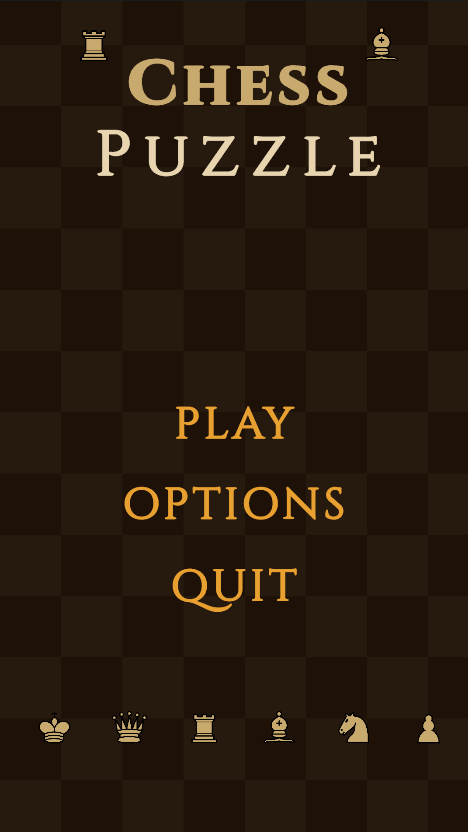
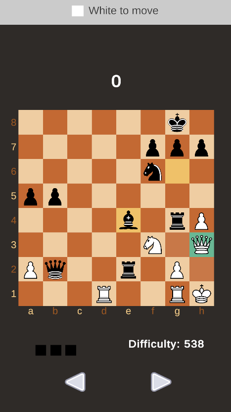

# Chess Puzzle

A mobile chess puzzle game built with Unity.
Solve chess puzzles in survival mode before losing all 3 lives!

## Gameplay
The game presents chess puzzles of increasing difficulty. 
The player must find the correct move for each puzzle.
For each wrong move a life is lost. The game ends when all 3 lives are lost.

## Features
- Survival mode with progressive difficulty
- Drag & drop and click-to-move on mobile
- 3-2-1 countdown before each game
- Move history navigation with arrows
- Leaderboard system with username
- Options menu (music volume, SFX toggle)
- Game Over screen with leaderboard

## Screenshots

## Built With
- Unity
- C#

## How to Play
1. Enter your username
2. Wait for the countdown
3. Solve the chess puzzle by moving the correct piece
4. Try to solve as many puzzles as possible!
